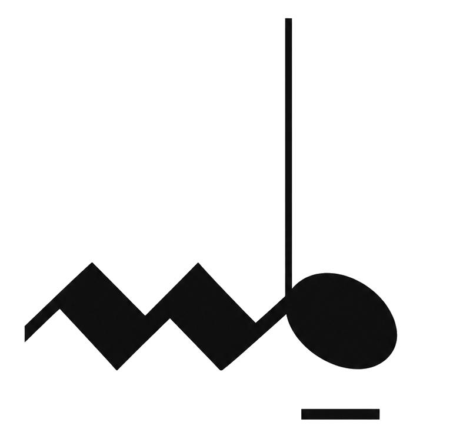
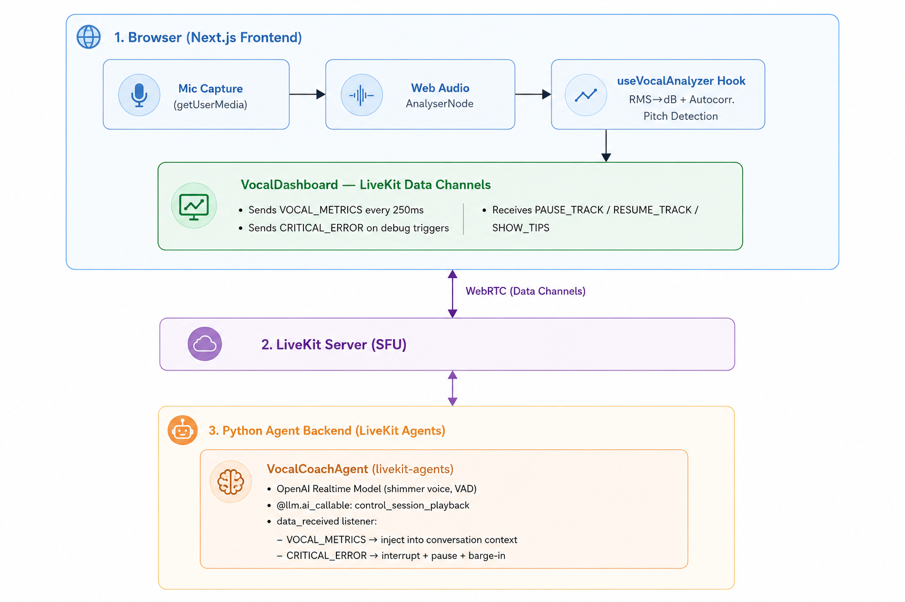

<p align="center">
  
</p>

<h1 align="center">Interactive AI Vocal Coach</h1>

<p align="center">
  A real-time AI-powered vocal coaching application built with <strong>Next.js</strong>, <strong>LiveKit WebRTC</strong>, and <strong>OpenAI Realtime Multimodal Audio</strong>.
</p>

## Features

- **Live pitch analysis** — Web Audio API pitch detection with volume, clarity, and cent-level accuracy vs. expected syllable targets
- **Karaoke coaching mode** — syllable-by-syllable pitch lane, backing-track playback, and automatic fault detection
- **Conversational coaching mode** — free-form voice coaching without a fixed song track
- **AI vocal coach agent** — OpenAI Realtime model that listens, speaks, and issues barge-in corrections over LiveKit
- **Instrument demonstrations** — piano/guitar reference tones and note sequences on an on-screen note board
- **Coach message panel** — live transcript, tips, and visual cues from the agent
- **Auto session setup** — token generation and agent dispatch via `/api/token` (no manual CLI step required)

## Architecture



The browser captures microphone audio, runs local pitch analysis, and streams telemetry to a LiveKit **vocal-coach** agent over data channels. The agent uses OpenAI Realtime for speech and can pause playback, play reference tones, or push coaching directives back to the client.

## Data Protocol

### Client → Agent (`telemetry` topic)

| Type | Example payload |
|------|-----------------|
| `SONG_SELECTED` | `{ "type": "SONG_SELECTED", "song_id": "en001a", "songname": "Alphabet", "tempo": 100 }` |
| `VOCAL_METRICS` | `{ "type": "VOCAL_METRICS", "volume_db": -22.4, "pitch_hz": 277.2, "syllable": "b_ii", "expected_pitch_hz": 277.2, "pitch_delta_cents": -42, "on_pitch": false, "coaching_mode": "karaoke" }` |
| `SYLLABLE_RESULT` | `{ "type": "SYLLABLE_RESULT", "syllable": "b_ii", "issue": "sharp", "pitch_error_cents": 42 }` |
| `CRITICAL_ERROR` | `{ "type": "CRITICAL_ERROR", "reason": "PITCH_OFF_TARGET", "syllable": "b_ii", "expected_hz": 277.2, "actual_hz": 295.0 }` |
| `ANALYSIS_SNAPSHOT` | `{ "type": "ANALYSIS_SNAPSHOT", "pitch_hz": 277.2, "pitch_confidence": 0.82, "clarity": 0.65, "note_name": "C#4" }` |
| `COACHING_MODE` | `{ "type": "COACHING_MODE", "mode": "karaoke" }` |

### Agent → Client (`session_control` topic)

| Action | Description |
|--------|-------------|
| `PAUSE_TRACK` | Pause karaoke backing track during an intervention |
| `RESUME_TRACK` | Resume playback after coaching |
| `SHOW_TIPS` | Display longer-form coaching notes in the message panel |
| `SHOW_CUE` | Short on-screen visual cue (`cue`, `tone`: `positive` \| `corrective` \| `neutral`) |
| `SHOW_NOTES` | Highlight notes on the instrument board (`notes`, `instrument`) |
| `PLAY_REFERENCE_TONE` | Play a single reference pitch (`frequency_hz`, `duration_ms`, `note_name`, `instrument`) |
| `PLAY_NOTE_SEQUENCE` | Play a sequence of notes for demonstration |
| `PLAY_LYRIC_LINE` | Synthesize a lyric line by syllable (`line_index`) |
| `REQUEST_ANALYSIS` | Ask the client to send an `ANALYSIS_SNAPSHOT` |

## Getting Started

### Prerequisites

- Node.js 18+
- Python 3.10+
- A [LiveKit Cloud](https://livekit.io) project (or self-hosted server)
- An [OpenAI API key](https://platform.openai.com) with Realtime API access

### Quick setup

From the repo root:

```bash
./setup.sh
```

This creates the Python virtual environment, installs backend and frontend dependencies, and symlinks the sample backing track (`en001a.wav`) into `frontend/public/songs/`.

### Environment variables

**Backend** (`backend/.env`):

```bash
cp backend/.env.example backend/.env
```

| Variable | Purpose |
|----------|---------|
| `LIVEKIT_URL` | LiveKit server WebSocket URL |
| `LIVEKIT_API_KEY` | LiveKit API key |
| `LIVEKIT_API_SECRET` | LiveKit API secret |
| `OPENAI_API_KEY` | OpenAI key with Realtime access |

**Frontend** (`frontend/.env.local`):

```bash
cp frontend/.env.example frontend/.env.local
```

| Variable | Purpose |
|----------|---------|
| `NEXT_PUBLIC_LIVEKIT_URL` | LiveKit server URL (browser) |
| `LIVEKIT_API_KEY` | Used by `/api/token` to mint access tokens |
| `LIVEKIT_API_SECRET` | Used by `/api/token` to dispatch the vocal-coach agent |

### Run the app

In two terminals from the repo root:

```bash
./run_backend.sh    # LiveKit agent (python main.py dev)
./run_frontend.sh   # Next.js dev server at http://localhost:3000
```

Open the frontend, enter your LiveKit server URL, and click **Join Session**. If you leave the token field empty, the app calls `/api/token` to generate a token and dispatch the `vocal-coach` agent to a fresh room automatically.

You can also pass a pre-generated token via query string: `?token=...&serverUrl=wss://...`

### Manual token generation (optional)

```bash
livekit-cli create-token \
  --api-key <YOUR_KEY> \
  --api-secret <YOUR_SECRET> \
  --join --room "coaching-room" \
  --identity "student-1" \
  --valid-for 24h
```

## Song data

Practice songs live in `alphabet_data/`:

```
alphabet_data/
├── metadata.json    # song names, tempo, key, time signature
├── csv/             # syllable-level pitch annotations
├── lyric/           # lyric text per song
├── txt/             # phonetic syllable tokens
└── wav/             # backing-track audio (served via /api/audio/<id>)
```

The bundled demo song is **Alphabet** (`en001a`). Song definitions are compiled into `frontend/src/lib/songs/`; backing tracks are streamed from `/api/audio/en001a` or `public/songs/en001a.wav`.

## Project structure

```
├── setup.sh / run_backend.sh / run_frontend.sh
├── alphabet_data/              # Shared song corpus
├── backend/
│   ├── .env.example
│   ├── requirements.txt
│   └── main.py                 # LiveKit vocal-coach agent
├── frontend/
│   ├── .env.example
│   ├── src/
│   │   ├── app/
│   │   │   ├── api/
│   │   │   │   ├── token/route.ts      # Token mint + agent dispatch
│   │   │   │   └── audio/[id]/route.ts # WAV backing-track proxy
│   │   │   ├── globals.css
│   │   │   ├── layout.tsx
│   │   │   └── page.tsx                # Pre-join + connect flow
│   │   ├── components/
│   │   │   ├── LiveKitProvider.tsx     # Room wrapper
│   │   │   ├── VocalDashboard.tsx      # Main coaching UI
│   │   │   ├── PitchLane.tsx           # Syllable pitch lane
│   │   │   ├── PitchContourChart.tsx   # Live pitch contour
│   │   │   ├── CoachMessagePanel.tsx   # Agent messages & cues
│   │   │   ├── InstrumentNoteBoard.tsx # Piano/guitar note board
│   │   │   ├── SyllableLyrics.tsx      # Karaoke lyrics
│   │   │   ├── PerformanceIssues.tsx   # Fault history
│   │   │   └── LiveSoundEnergy.tsx     # Volume meter
│   │   ├── hooks/
│   │   │   ├── useVocalAnalyzer.ts     # Mic pitch/volume analysis
│   │   │   ├── useSongPlayback.ts      # Backing-track player
│   │   │   ├── useSyllableTracker.ts   # Syllable timing & scoring
│   │   │   ├── useTonePlayer.ts        # Reference-tone synth
│   │   │   └── useKaraokeBackingTrack.ts
│   │   └── lib/
│   │       ├── audio/                  # Pitch detection, synth, mic capture
│   │       └── songs/                  # Song bundles & pitch helpers
│   └── public/songs/                   # Local WAV fallback (setup.sh links en001a)
└── images/                             # Logo and architecture diagram
```
